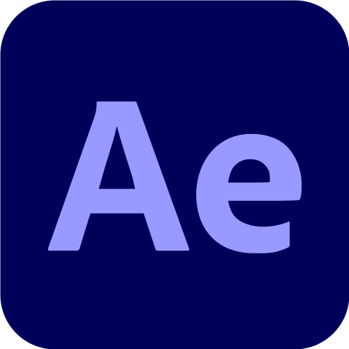
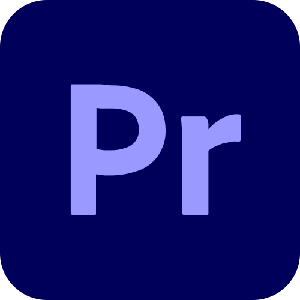

## Hello! My name is Ivan 👋

### I'm an aspring Web Developer  with an extensive background in Visual Design 

- While looking for employment I'm learning to broaden my current skillset with new technologies

 

### Skills & tools

---

 

 

---

### Drop me a line
