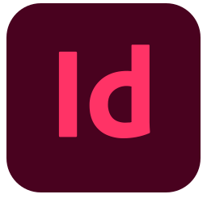

## Hello! My name is Ivan 👋

### I'm an aspring Web Developer  with an extensive background in Visual Design 

- While looking for employment I'm learning to broaden my current skillset with new technologies

#### Skills & tools

 

### Drop me a line
